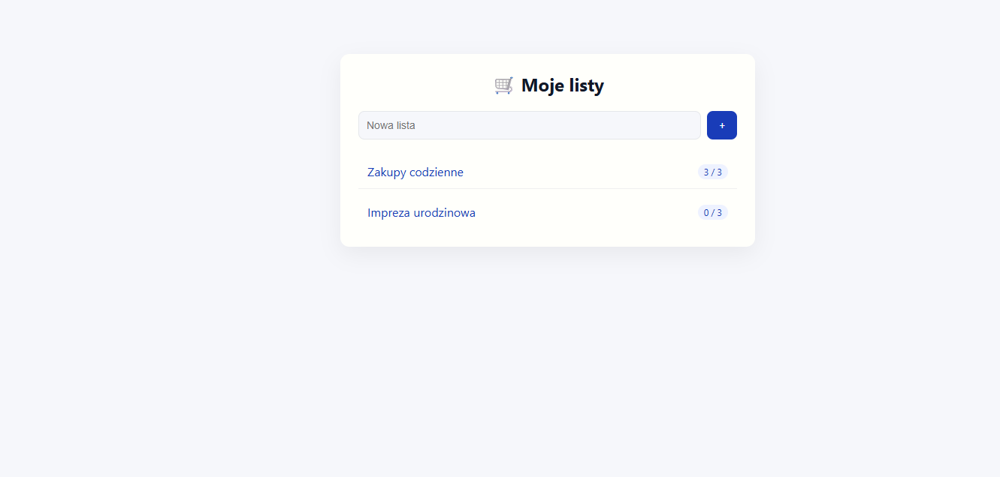
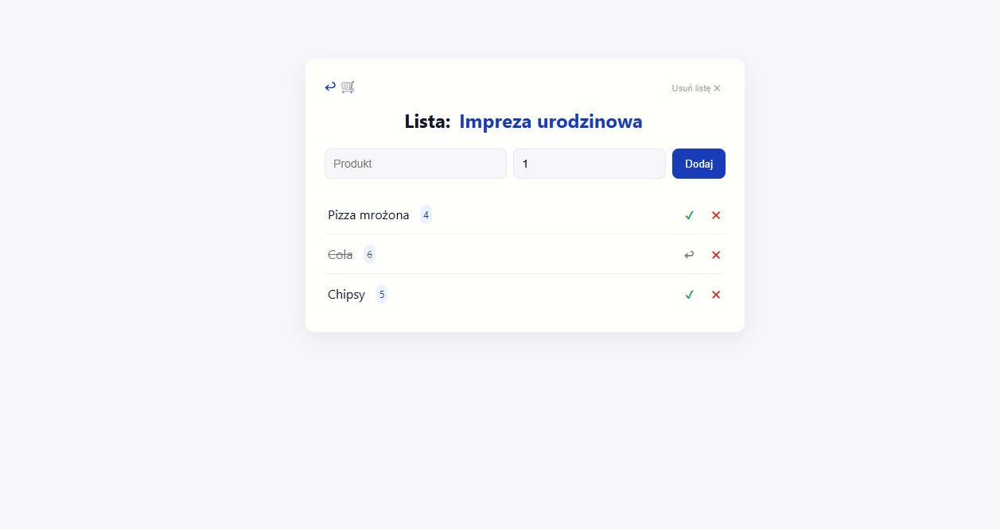
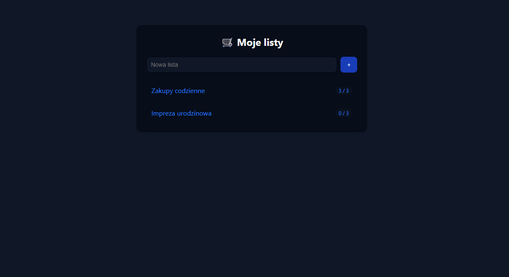

# Listuś

Prosta aplikacja w .NET wykonana w ramach przedmiotu Programowanie Obiektowe.

Umożliwia tworzenie i zarządzanie listami zakupów.

## Wymagania i przykłady realizacji:
1. Instrukcje warunkowe
```cs
private void SetName(string name)
{
    if (string.IsNullOrWhiteSpace(name))
        throw new ArgumentException("Nazwa nie może być pusta");

    Name = name;
}
```
2. Pętle
```cs
foreach (var item in t.Result)
{
    item.MarkAsBought();
}
```
3. Kolekcje generyczne
```cs
    public List<ShoppingItem> Items { get; private set; } = new();
    // ...
    public void AddItem(ShoppingItem item)
    {
        Items.Add(item);
    }

    public bool RemoveItemByName(string name)
    {
        var item = Items.FirstOrDefault(i => i.Name == name);
        if (item != null)
        {
            Items.Remove(item);
            return true;
        }
        return false;
    }

    ///
    app.MapGet("/lists/{listId}/with-items", async (int listId, AppDbContext db) => {
      var list = await db.Lists
        .Include(l => l.Items)
        .FirstOrDefaultAsync(l => l.Id == listId);
      return list is not null ? Results.Ok(list) : Results.NotFound();
    });
```
4. Wszystkie filary obiektowości
a. Dziedziczenie
```cs
public class ShoppingItem : BaseItem
{
    // ...
}
```
b. Polimorfizm
```cs
public override void Update(string name, int quantity)
{
    // ...
}
```
c. Hermetyzację
```cs
public int Id { get; private set; }
public bool IsBought { get; private set; }
```
5. Połączenie z bazą danych lub zapisywanie/odczyt danych do pliku w formacie JSON
```cs
builder.Services.AddDbContext<AppDbContext>(
    o => o.UseSqlite(builder.Configuration.GetConnectionString("DefaultConnection")));
```

## Info
Projekt jest wyjątkowo prosty, bez renderowania serwerowego oraz bez zabezpieczeń, walidacji czy optymalizacji.




